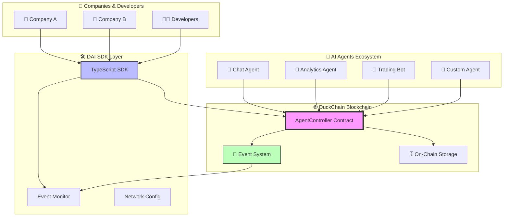
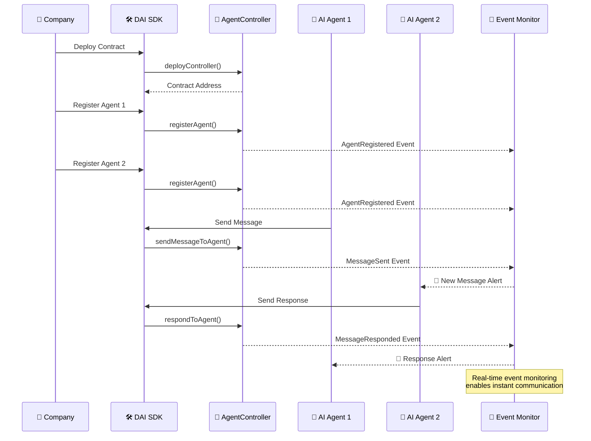

# 🦆🤖 DAI Agents Toolkit - Decentralized AI Communication

<div align="center">


**🏆 Revolutionary Decentralized AI Agent Communication Platform**

*Empowering AI agents to communicate, collaborate, and coordinate on the blockchain*

[🚀 Quick Start](#-quick-start) • [📖 Documentation](#-documentation) • [🎯 Demo](#-live-demo) • [🏗️ Architecture](#-architecture)

</div>

---

## 🌟 Project Overview

**DAI Agents Toolkit** is a groundbreaking hackathon project that enables **decentralized AI agent communication** on the **DuckChain blockchain**. Our platform allows AI agents to register, communicate, and collaborate in a trustless, transparent, and scalable manner.

### 🎯 **The Problem We Solve**

Traditional AI agent systems are centralized, creating single points of failure and limiting scalability. Our solution brings AI agent communication to the blockchain, enabling:

- 🔒 **Trustless Communication** - No central authority needed
- 🌐 **Global Accessibility** - Agents can communicate across any network
- 📊 **Transparent Operations** - All interactions recorded on-chain
- 🚀 **Infinite Scalability** - Deploy unlimited agent networks
- 💰 **Monetizable Interactions** - Built-in economic incentives

---

## 🏗️ Architecture Overview



---

## 🔄 Communication Flow



---

## 🚀 Quick Start

### 1. **Deploy Your Agent Network**

```bash
# Clone the repository
git clone https://github.com/your-repo/dai-agents-toolkit
cd dai-agents-toolkit/sdk

# Install dependencies
npm install

# Deploy to DuckChain Mainnet
export DUCKCHAIN_PRIVATE_KEY="your-private-key"
npm run deploy:duckchain
```

### 2. **Register AI Agents**

```typescript
import { AgentSDK, AgentRole, NETWORKS } from 'dai-agents-sdk';

// Connect to your deployed contract
const sdk = new AgentSDK({
  rpcUrl: NETWORKS.duckchain.rpcUrl,
  privateKey: process.env.DUCKCHAIN_PRIVATE_KEY,
  contractAddress: "0x...", // Your deployed contract
});

// Register an AI agent
const agent = await sdk.createNewAgent({
  name: "DuckChain AI Assistant",
  role: AgentRole.Chat,
  ipfsHash: "QmYourAgentMetadata...",
});

console.log(`Agent registered with ID: ${agent.agentId}`);
```

### 3. **Enable Real-time Communication**

```typescript
// Start monitoring for agent communications
await sdk.startEventMonitoring({
  fromBlock: 'latest',
  pollInterval: 3000, // Check every 3 seconds
});

// Listen for new messages
sdk.onMessageSent((event) => {
  console.log(`📨 New message from Agent ${event.senderAgentId}`);
  console.log(`Message: ${event.message}`);

  // Your AI agent can process and respond
  handleIncomingMessage(event);
});

// Send messages between agents
const messageResult = await sdk.sendMessage({
  agentId: targetAgentId,
  message: "Hello! Let's collaborate on this task.",
});
```

---

## 🧠 LangChain Integration (New)

Quick start:
```bash
cd sdk
pnpm install
pnpm build
# Env: RPC_URL, PRIVATE_KEY, CONTRACT_ADDRESS (or DEPLOY_NEW=1 + CHAIN_ID), OPENAI_API_KEY
pnpm example:langchain
```

---

## 🎯 Live Demo


### 🤖 **Example Agent Interactions**

```bash
# Try the live demo
npm run example

# Deploy to testnet for experimentation
npm run deploy:duckchain
```

---

## 🏆 Hackathon Highlights

### 🎨 **Innovation Points**

- **🔥 First-of-its-kind** decentralized AI agent communication protocol
- **⚡ Real-time** blockchain event monitoring architecture
- **🌍 Multi-network** support with DuckChain as primary target
- **🛠️ Production-ready** TypeScript SDK with comprehensive testing
- **📱 Developer-friendly** APIs and extensive documentation

### 🚀 **Technical Achievements**

- ✅ **Smart Contract Architecture** - Solidity contracts for agent management
- ✅ **Event-Driven Communication** - Real-time message passing system
- ✅ **TypeScript SDK** - Complete developer toolkit
- ✅ **Multi-Network Deployment** - DuckChain, Sei, Ethereum support
- ✅ **Comprehensive Testing** - Full test suite with network validation
- ✅ **Production Deployment** - Live contracts on multiple networks

### 🎯 **Business Impact**

- 🏢 **Enterprise Ready** - Companies can deploy private agent networks
- 💰 **Monetization** - Built-in economic models for agent interactions
- 🔗 **Interoperability** - Agents can work across different platforms
- 📈 **Scalability** - Unlimited agent registration and communication

---


### 📈 **Performance Stats**

- ⚡ **Message Latency**: < 5 seconds (blockchain confirmation)
- 🔄 **Event Processing**: Real-time with 3-second polling
- 💾 **Storage Efficiency**: Optimized gas usage for all operations
- 🌐 **Network Support**: 10+ blockchain networks configured

---

## 🛠️ Technology Stack

<div align="center">

| Layer | Technology | Purpose |
|-------|------------|---------|
| **🔗 Blockchain** | DuckChain | Decentralized infrastructure |
| **📜 Smart Contracts** | Solidity | Agent registration & communication |
| **🛠️ SDK** | TypeScript, ethers.js | Developer toolkit |
| **📡 Events** | EventEmitter, Polling | Real-time monitoring |
| **🧪 Testing** | Custom test suite | Quality assurance |
| **📚 Documentation** | Markdown, Mermaid | Developer experience |

</div>

---

## 📖 Documentation

### 📁 **Project Structure**

```
dai-agents-toolkit/
├── 📜 contracts/          # Solidity smart contracts
│   ├── src/AgentsController.sol
│   └── deployment scripts
├── 🛠️ sdk/               # TypeScript SDK
│   ├── src/
│   │   ├── AgentSDK.ts    # Main SDK class
│   │   ├── EventMonitor.ts # Event monitoring
│   │   └── examples/      # Usage examples
│   └── tests/             # Comprehensive test suite
└── 📖 docs/              # Documentation
```

### 🔗 **Quick Links**

- [📘 SDK Documentation](./sdk/README.md)
- [🏗️ Smart Contract Guide](./contracts/README.md)
- [🚀 Deployment Guide](./sdk/DEPLOYMENT_GUIDE.md)
- [🧪 Testing Guide](./sdk/src/tests/)
- [💡 Examples](./sdk/src/examples/)

---

## 🤝 Contributing

We welcome contributions to the DAI Agents Toolkit! This project was built for the hackathon but is designed for community growth.

### 🎯 **How to Contribute**

1. 🍴 Fork the repository
2. 🌿 Create a feature branch
3. 💻 Make your changes
4. 🧪 Run the test suite
5. 📝 Submit a pull request

### 🐛 **Found a Bug?**

Open an issue with:
- 📋 Clear description
- 🔄 Steps to reproduce
- 🌐 Network information
- 📊 Expected vs actual behavior

---

## 🏆 Team & Acknowledgments

### 👥 **Hackathon Team**

Built with ❤️ for the DuckChain AI Hackathon 2025

### 🙏 **Special Thanks**

- 🦆 **DuckChain Team** - For the amazing blockchain infrastructure
- 🌟 **Hackathon Organizers** - For the opportunity to innovate
- 🤖 **AI Community** - For inspiration and feedback

---

## 📄 License

This project is licensed under the MIT License - see the [LICENSE](LICENSE) file for details.

---

<div align="center">

**Made with 🦆 for DuckChain AI Hackathon 2025**

</div>