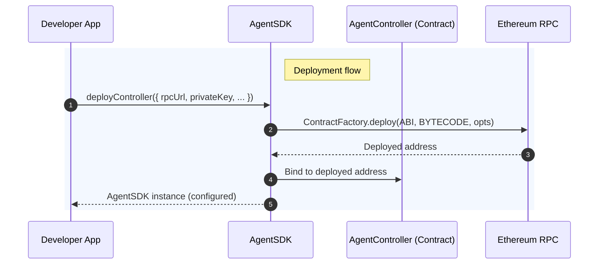
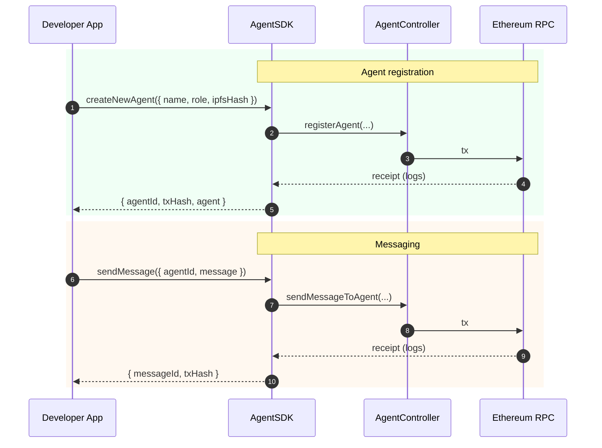
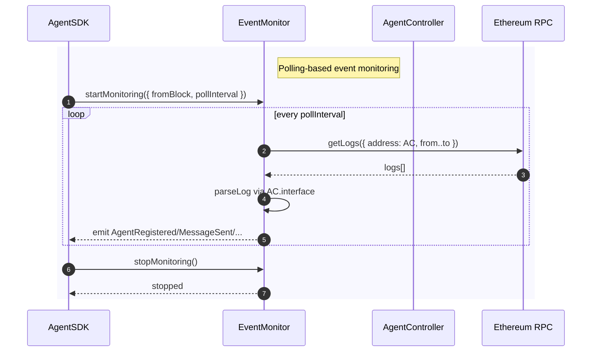

## Sequence Diagram(s)

```mermaid
sequenceDiagram
  autonumber
  participant Dev as Developer App
  participant SDK as AgentSDK
  participant AC as AgentController (Contract)
  participant ETH as Ethereum RPC

  rect rgb(243,248,255)
  note right of SDK: Deployment flow
  Dev->>SDK: deployController({ rpcUrl, privateKey, ... })
  SDK->>ETH: ContractFactory.deploy(ABI, BYTECODE, opts)
  ETH-->>SDK: Deployed address
  SDK->>AC: Bind to deployed address
  SDK-->>Dev: AgentSDK instance (configured)
  end
```

```mermaid
sequenceDiagram
  autonumber
  participant Dev as Developer App
  participant SDK as AgentSDK
  participant AC as AgentController
  participant ETH as Ethereum RPC

  rect rgb(240,255,245)
  note over SDK,ETH: Agent registration
  Dev->>SDK: createNewAgent({ name, role, ipfsHash })
  SDK->>AC: registerAgent(...)
  AC->>ETH: tx
  ETH-->>SDK: receipt (logs)
  SDK-->>Dev: { agentId, txHash, agent }
  end

  rect rgb(255,248,240)
  note over SDK,ETH: Messaging
  Dev->>SDK: sendMessage({ agentId, message })
  SDK->>AC: sendMessageToAgent(...)
  AC->>ETH: tx
  ETH-->>SDK: receipt (logs)
  SDK-->>Dev: { messageId, txHash }
  end
```

```mermaid
sequenceDiagram
  autonumber
  participant SDK as AgentSDK
  participant EM as EventMonitor
  participant AC as AgentController
  participant ETH as Ethereum RPC

  rect rgb(248,248,255)
  note right of EM: Polling-based event monitoring
  SDK->>EM: startMonitoring({ fromBlock, pollInterval })
  loop every pollInterval
    EM->>ETH: getLogs({ address: AC, from..to })
    ETH-->>EM: logs[]
    EM->>EM: parseLog via AC.interface
    EM-->>SDK: emit AgentRegistered/MessageSent/...
  end
  SDK->>EM: stopMonitoring()
  EM-->>SDK: stopped
  end
```